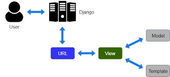

# Tugas Pemrograman PBP
---
## Tugas 2

### Implementasi Checklist (Step by Step)
1. **Setup Project**  
   - Membuat virtual environment dan menginstall Django.  
   - Membuat project Django (`django-admin startproject`).  
   - Membuat aplikasi utama `main`.  

2. **Membuat Model**  
   - Membuat model `Product` dengan atribut `name`, `brand`,   `description`, `thumbnail`, `discount`, `price`, `stock`, `category`, dan relasi ke `Size`.  
   - Menentukan `CATEGORY_CHOICES` agar data produk lebih terstruktur.  

3. **Membuat Views dan Routing**  
   - Menambahkan function/class di `views.py` untuk menampilkan daftar produk.  
   - Mengatur `urls.py` agar request client diarahkan ke views yang sesuai.  

4. **Membuat Template HTML**  
   - Membuat folder `templates/` untuk file `.html`.  
   - Menghubungkan data dari views ke HTML dengan Django template engine (`{{ ... }}`).  

5. **Migrasi Database**  
   - Menjalankan `python manage.py makemigrations` dan `python manage.py migrate` untuk membuat serta menerapkan struktur tabel database.  

6. **Testing dan Deployment**  
   - Menjalankan server lokal (`python manage.py runserver`).  
   - Men-deploy aplikasi ke platform hosting (misalnya PWS di mata kuliah PBP ini).  

---

###  Alur Request-Response (Bagan)

Source : https://python.plainenglish.io/mastering-django-mvt-a-complete-guide-for-beginners-and-advanced-developers-8c609e7b5da7?gi=1af76189b72c

#### Penjelasan:
- **urls.py**: menentukan path URL mana yang akan diarahkan ke fungsi/kelas tertentu di views.  
- **views.py**: mengatur logika pemrosesan request (misalnya ambil data produk dari database).  
- **models.py**: mendefinisikan struktur data & ORM untuk akses database.  
- **HTML (templates)**: menampilkan data ke user dalam bentuk halaman web.  

---

### Peran `settings.py`
File `settings.py` berfungsi sebagai pusat konfigurasi proyek Django, meliputi:
- Database (ENGINE, NAME, USER, PASSWORD, HOST, PORT).  
- Installed apps (`INSTALLED_APPS`).  
- Middleware.  
- Static files & template directories.  
- Secret key & debug mode.  
- Konfigurasi deployment (allowed hosts, dll).  

---

### Cara Kerja Migrasi Database di Django
1. `python manage.py makemigrations`  
   Membuat file migrasi berdasarkan perubahan pada `models.py`.  

2. `python manage.py migrate`  
   Menerapkan file migrasi tersebut ke database (membuat/mengubah tabel sesuai model).  

Dengan cara ini, Django mempermudah sinkronisasi antara kode model dengan struktur database tanpa harus menulis SQL manual.  

---

### Mengapa Django Cocok Sebagai Framework Awal?
- **Batteries included**: sudah menyediakan banyak fitur bawaan (ORM, auth, admin panel).  
- **Struktur jelas (MVC/MVT)**: memudahkan pemula memahami alur request–response.  
- **Komunitas besar & dokumentasi lengkap**: memudahkan belajar.  
---

### Feedback untuk Asisten Dosen
Menurut saya, asisten dosen hingga saat ini sudah cukup bagus buat saya.  

---

## Tugas 3

### Mengapa Kita Memerlukan Data Delivery dalam Platform
Data delivery penting karena:
- Memungkinkan **pertukaran data** antara client dan server.
- Memberikan **respon real-time** terhadap request pengguna.
- Memastikan **integritas dan keamanan data** saat berpindah dari backend ke frontend.
- Tanpa mekanisme delivery yang jelas, data bisa terlambat, salah format, atau rawan disalahgunakan.

### XML vs JSON
- **XML** adalah format berbasis tag yang verbose, mendukung atribut dan skema yang kompleks.  
- **JSON** adalah format berbasis key-value yang ringan dan mudah dibaca.  

**Mengapa JSON lebih populer:**
- Sintaks lebih sederhana dan lebih mudah dipahami.
- Ukuran data lebih kecil (ringan untuk jaringan).
- Native support di JavaScript dan hampir semua bahasa modern.
- Lebih mudah diparse langsung menjadi object.

### Fungsi `is_valid()` pada Form Django
- Method ini melakukan **validasi otomatis** pada data yang dikirim lewat form berdasarkan field dan rules di `forms.py`.
- Mengembalikan `True` bila data sesuai aturan, `False` bila ada error.
- Setelah dipanggil, kita bisa akses `form.cleaned_data` untuk mengambil data yang sudah bersih.
- Tanpa `is_valid()`, kita harus memvalidasi manual setiap field, rawan bug dan tidak konsisten.

### Mengapa Kita Membutuhkan `csrf_token` di Form Django
- `csrf_token` adalah token unik yang ditambahkan Django di setiap form untuk mencegah **CSRF (Cross Site Request Forgery)**.
- Jika kita tidak menambahkannya, penyerang bisa membuat halaman berbahaya yang mengirim request ke server kita **atas nama user** yang sedang login.
- Dengan `csrf_token`, setiap form harus membawa token yang cocok dengan session user; tanpa token ini request akan ditolak.

### Implementasi Checklist Step by Step
1. **Setup Project**  
   - Membuat virtual environment dan menginstal Django.  
   - Membuat project Django (`django-admin startproject`) dan app utama (`python manage.py startapp main`).  

2. **Membuat Model & Form**  
   - Membuat model `Product`, `Size`, dan `ProductSize`.  
   - Menentukan `CATEGORY_CHOICES` agar data lebih terstruktur.  
   - Membuat `forms.py` berisi `ProductForm` dan `ProductSizeFormSet` untuk input data.  

3. **Membuat Views dan Routing**  
   - Menambahkan function `create_product`, `show_main`, dan `show_product` di `views.py`.  
   - Mengatur `urls.py` untuk mengarahkan path ke views yang sesuai.  

4. **Membuat Template HTML**  
   - Membuat folder `templates/` berisi `create_product.html` dan `product_detail.html`.  
   - Menggunakan Django template engine (`{{ ... }}`) untuk menampilkan data dari views.  

5. **Migrasi Database**  
   - Menjalankan `python manage.py makemigrations` dan `python manage.py migrate` untuk menerapkan model ke database.  

6. **Testing dan Deployment**  
   - Menjalankan server lokal dengan `python manage.py runserver`.  
   - Men-deploy aplikasi ke platform hosting (misalnya PWS).  

### Feedback untuk Asdos Tutorial 2
Asdos sudah cukup jelas dalam menjelaskan materi dan membantu ketika ada kendala.  

###  Bukti Screen Shoot Postman

Postman XML

Postman XML by ID

Postman JSON

Postman JSON by ID

### Refrensi 
Pada pembuatan model, saya menggunakan GPT untuk menentukan bentuk model terbaik supaya efisien untuk menentukan penempatan size.

---

## Tugas 4

### Django AuthenticationForm
`AuthenticationForm` adalah form bawaan Django yang digunakan untuk proses **login user**.  
Form ini secara otomatis menyediakan field `username` dan `password`, serta melakukan validasi terhadap data login tersebut.

**Kelebihan:**
- Praktis: tidak perlu membuat form login dari nol.
- Terintegrasi langsung dengan sistem autentikasi Django (`django.contrib.auth`).
- Sudah ada validasi bawaan (misalnya user tidak aktif atau password salah).

**Kekurangan:**
- Kurang fleksibel: perlu kustomisasi tambahan kalau ingin menambahkan field lain.
- Tampilan default-nya polos, jadi harus diubah sendiri agar menarik.

---

### Perbedaan Autentikasi dan Otorisasi
- **Autentikasi (Authentication)** → proses **memastikan identitas user** (misalnya login dengan username dan password).  
- **Otorisasi (Authorization)** → proses **menentukan hak akses user** setelah identitasnya diketahui (misalnya hanya admin bisa menghapus data).

**Implementasi di Django:**
- Autentikasi dilakukan lewat `django.contrib.auth` (login/logout, `authenticate()`, `login()`, `AuthenticationForm`).
- Otorisasi dilakukan lewat `User.is_staff`, `User.is_superuser`, `@login_required`, `@permission_required`, dan `request.user.has_perm()`.

---

## Session vs Cookies
**Cookies:**
- Disimpan di browser user.
- Bisa bertahan setelah browser ditutup.
- Mudah dibaca/dimodifikasi user (kurang aman untuk data sensitif).

**Session:**
- Disimpan di server Django, hanya ID session-nya yang dikirim lewat cookies.
- Lebih aman karena user tidak bisa ubah data di server langsung.
- Tapi butuh penyimpanan di sisi server dan bisa membebani server jika user banyak.

**Dalam konteks state:**  
Session lebih cocok untuk menyimpan data login atau keranjang belanja (state penting), sedangkan cookies cocok untuk preferensi ringan (tema, bahasa, dll).

---

### Keamanan Penggunaan Cookies
- Cookies **tidak sepenuhnya aman** karena bisa dicuri lewat serangan **XSS** atau **intersepsi jaringan**.
- Django menangani ini dengan:
  - Mengaktifkan `HttpOnly` → cookie tidak bisa diakses JavaScript.
  - Mengaktifkan `Secure` → cookie hanya dikirim lewat HTTPS.
  - Menggunakan `CSRF token` untuk mencegah request palsu.
- Developer juga perlu menghindari menyimpan data sensitif langsung di cookies.

---

### Implementasi Checklist (Step by Step)
1. **Setup Project**
   - Buat virtual environment dan install Django.
   - Buat project (`django-admin startproject`) dan app `main`.

2. **Buat Model dan Form**
   - Buat model `News` dengan field seperti `title`, `content`, `created_at`, `is_featured`.
   - Buat `forms.py` dengan `NewsForm`.

3. **Routing dan Views**
   - Buat fungsi `show_main`, `show_news`, `create_news`.
   - Tambahkan path di `main/urls.py`.

4. **Template**
   - Buat `base.html` dan `show_main.html` untuk menampilkan daftar berita.
   - Buat `create_news.html` untuk form input berita baru.

5. **Autentikasi**
   - Tambahkan `login` & `logout` menggunakan `AuthenticationForm`.
   - Lindungi halaman `create_news` dengan `@login_required`.

6. **Testing & Deployment**
   - Jalankan server lokal `python manage.py runserver`.
   - Deploy ke PWS.

---

### Feedback untuk Asdos
Asdos sudah cukup jelas membimbing dan responsif saat ada kendala. Secara keseluruhan tutorialnya sangat membantu memahami dasar autentikasi di Django.

---
