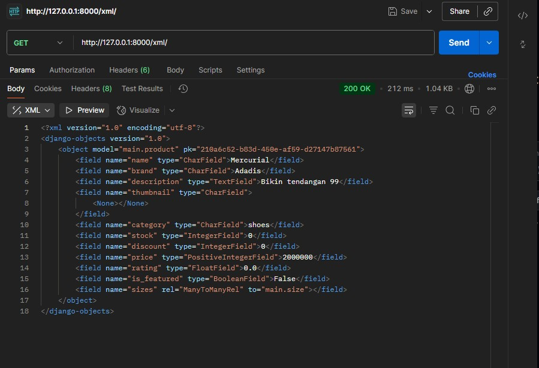
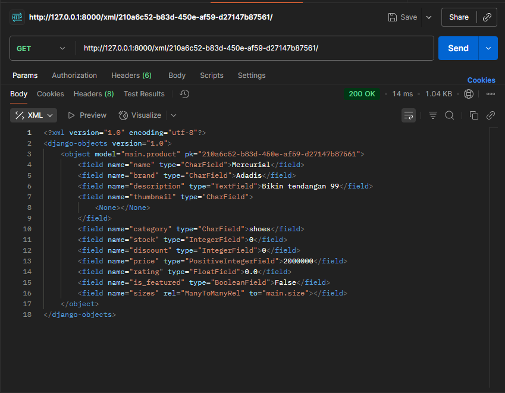
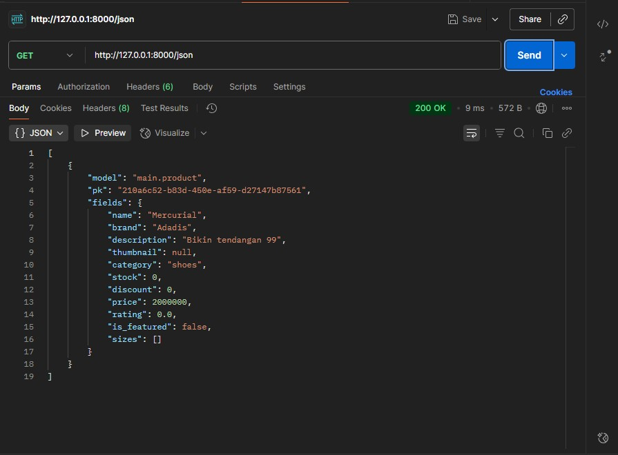
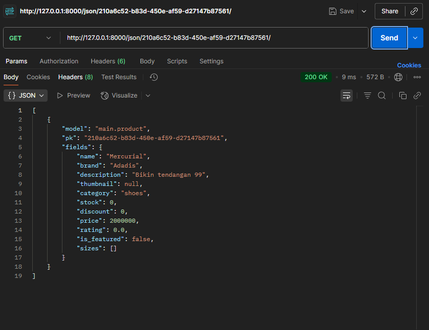

# Tugas Tutorial 2 PBP

## Mengapa Kita Memerlukan Data Delivery dalam Platform
Data delivery penting karena:
- Memungkinkan **pertukaran data** antara client dan server.
- Memberikan **respon real-time** terhadap request pengguna.
- Memastikan **integritas dan keamanan data** saat berpindah dari backend ke frontend.
- Tanpa mekanisme delivery yang jelas, data bisa terlambat, salah format, atau rawan disalahgunakan.

## XML vs JSON
- **XML** adalah format berbasis tag yang verbose, mendukung atribut dan skema yang kompleks.  
- **JSON** adalah format berbasis key-value yang ringan dan mudah dibaca.  

**Mengapa JSON lebih populer:**
- Sintaks lebih sederhana dan lebih mudah dipahami.
- Ukuran data lebih kecil (ringan untuk jaringan).
- Native support di JavaScript dan hampir semua bahasa modern.
- Lebih mudah diparse langsung menjadi object.

## Fungsi `is_valid()` pada Form Django
- Method ini melakukan **validasi otomatis** pada data yang dikirim lewat form berdasarkan field dan rules di `forms.py`.
- Mengembalikan `True` bila data sesuai aturan, `False` bila ada error.
- Setelah dipanggil, kita bisa akses `form.cleaned_data` untuk mengambil data yang sudah bersih.
- Tanpa `is_valid()`, kita harus memvalidasi manual setiap field, rawan bug dan tidak konsisten.

## Mengapa Kita Membutuhkan `csrf_token` di Form Django
- `csrf_token` adalah token unik yang ditambahkan Django di setiap form untuk mencegah **CSRF (Cross Site Request Forgery)**.
- Jika kita tidak menambahkannya, penyerang bisa membuat halaman berbahaya yang mengirim request ke server kita **atas nama user** yang sedang login.
- Dengan `csrf_token`, setiap form harus membawa token yang cocok dengan session user; tanpa token ini request akan ditolak.

## Implementasi Checklist Step by Step
1. **Setup Project**  
   - Membuat virtual environment dan menginstal Django.  
   - Membuat project Django (`django-admin startproject`) dan app utama (`python manage.py startapp main`).  

2. **Membuat Model & Form**  
   - Membuat model `Product`, `Size`, dan `ProductSize`.  
   - Menentukan `CATEGORY_CHOICES` agar data lebih terstruktur.  
   - Membuat `forms.py` berisi `ProductForm` dan `ProductSizeFormSet` untuk input data.  

3. **Membuat Views dan Routing**  
   - Menambahkan function `create_product`, `show_main`, dan `show_product` di `views.py`.  
   - Mengatur `urls.py` untuk mengarahkan path ke views yang sesuai.  

4. **Membuat Template HTML**  
   - Membuat folder `templates/` berisi `create_product.html` dan `product_detail.html`.  
   - Menggunakan Django template engine (`{{ ... }}`) untuk menampilkan data dari views.  

5. **Migrasi Database**  
   - Menjalankan `python manage.py makemigrations` dan `python manage.py migrate` untuk menerapkan model ke database.  

6. **Testing dan Deployment**  
   - Menjalankan server lokal dengan `python manage.py runserver`.  
   - Men-deploy aplikasi ke platform hosting (misalnya PWS).  

## Feedback untuk Asdos Tutorial 2
Asdos sudah cukup jelas dalam menjelaskan materi dan membantu ketika ada kendala.  

##  Bukti Screen Shoot Postman

Postman XML

Postman XML by ID

Postman JSON

Postman JSON by ID

## Refrensi 
Pada pembuatan model, saya menggunakan GPT untuk menentukan bentuk model terbaik supaya efisien untuk menentukan penempatan size.
