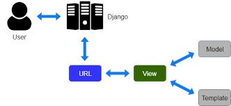

# ProScore - Football Shop Web Application

## Deployment
Aplikasi sudah di-deploy dan dapat diakses melalui tautan berikut:  
👉 [Link ke ProScore](https://made-shandy-footballshop.pbp.cs.ui.ac.id/)

---

## Implementasi Checklist (Step by Step)
1. **Setup Project**  
   - Membuat virtual environment dan menginstall Django.  
   - Membuat project Django (`django-admin startproject`).  
   - Membuat aplikasi utama `main`.  

2. **Membuat Model**  
   - Membuat model `Product` dengan atribut `name`, `brand`,   `description`, `thumbnail`, `discount`, `price`, `stock`, `category`, dan relasi ke `Size`.  
   - Menentukan `CATEGORY_CHOICES` agar data produk lebih terstruktur.  

3. **Membuat Views dan Routing**  
   - Menambahkan function/class di `views.py` untuk menampilkan daftar produk.  
   - Mengatur `urls.py` agar request client diarahkan ke views yang sesuai.  

4. **Membuat Template HTML**  
   - Membuat folder `templates/` untuk file `.html`.  
   - Menghubungkan data dari views ke HTML dengan Django template engine (`{{ ... }}`).  

5. **Migrasi Database**  
   - Menjalankan `python manage.py makemigrations` dan `python manage.py migrate` untuk membuat serta menerapkan struktur tabel database.  

6. **Testing dan Deployment**  
   - Menjalankan server lokal (`python manage.py runserver`).  
   - Men-deploy aplikasi ke platform hosting (misalnya PWS di mata kuliah PBP ini).  

---

##  Alur Request-Response (Bagan)

Source : https://python.plainenglish.io/mastering-django-mvt-a-complete-guide-for-beginners-and-advanced-developers-8c609e7b5da7?gi=1af76189b72c

### Penjelasan:
- **urls.py**: menentukan path URL mana yang akan diarahkan ke fungsi/kelas tertentu di views.  
- **views.py**: mengatur logika pemrosesan request (misalnya ambil data produk dari database).  
- **models.py**: mendefinisikan struktur data & ORM untuk akses database.  
- **HTML (templates)**: menampilkan data ke user dalam bentuk halaman web.  

---

## Peran `settings.py`
File `settings.py` berfungsi sebagai pusat konfigurasi proyek Django, meliputi:
- Database (ENGINE, NAME, USER, PASSWORD, HOST, PORT).  
- Installed apps (`INSTALLED_APPS`).  
- Middleware.  
- Static files & template directories.  
- Secret key & debug mode.  
- Konfigurasi deployment (allowed hosts, dll).  

---

## Cara Kerja Migrasi Database di Django
1. `python manage.py makemigrations`  
   Membuat file migrasi berdasarkan perubahan pada `models.py`.  

2. `python manage.py migrate`  
   Menerapkan file migrasi tersebut ke database (membuat/mengubah tabel sesuai model).  

Dengan cara ini, Django mempermudah sinkronisasi antara kode model dengan struktur database tanpa harus menulis SQL manual.  

---

## Mengapa Django Cocok Sebagai Framework Awal?
- **Batteries included**: sudah menyediakan banyak fitur bawaan (ORM, auth, admin panel).  
- **Struktur jelas (MVC/MVT)**: memudahkan pemula memahami alur request–response.  
- **Komunitas besar & dokumentasi lengkap**: memudahkan belajar.  
---

## Feedback untuk Asisten Dosen
Menurut saya, asisten dosen hingga saat ini sudah cukup bagus buat saya.  

